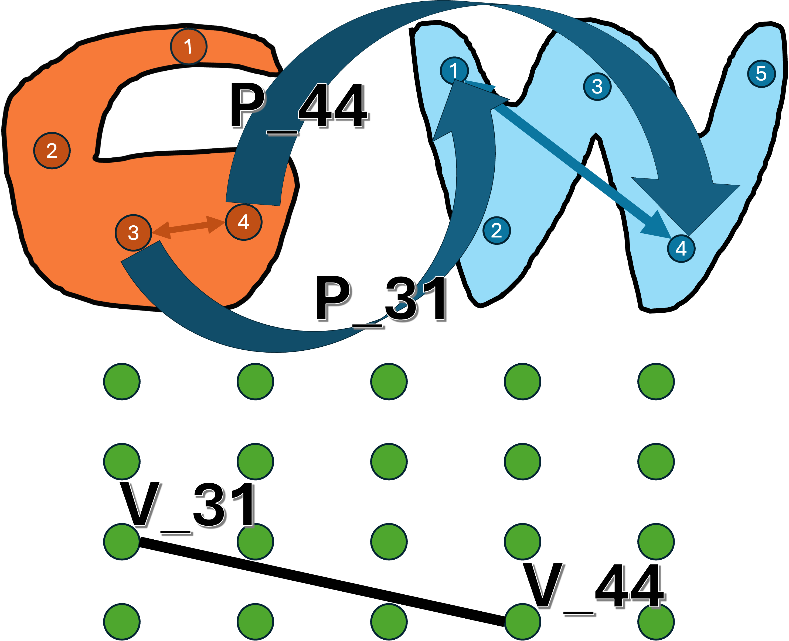
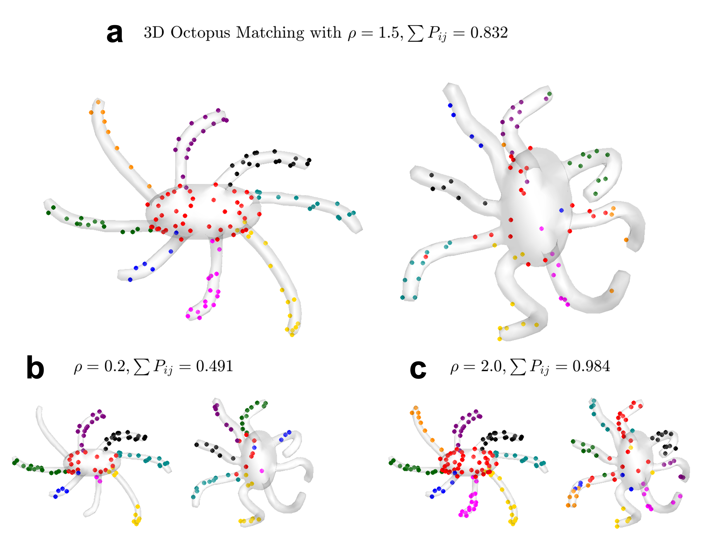
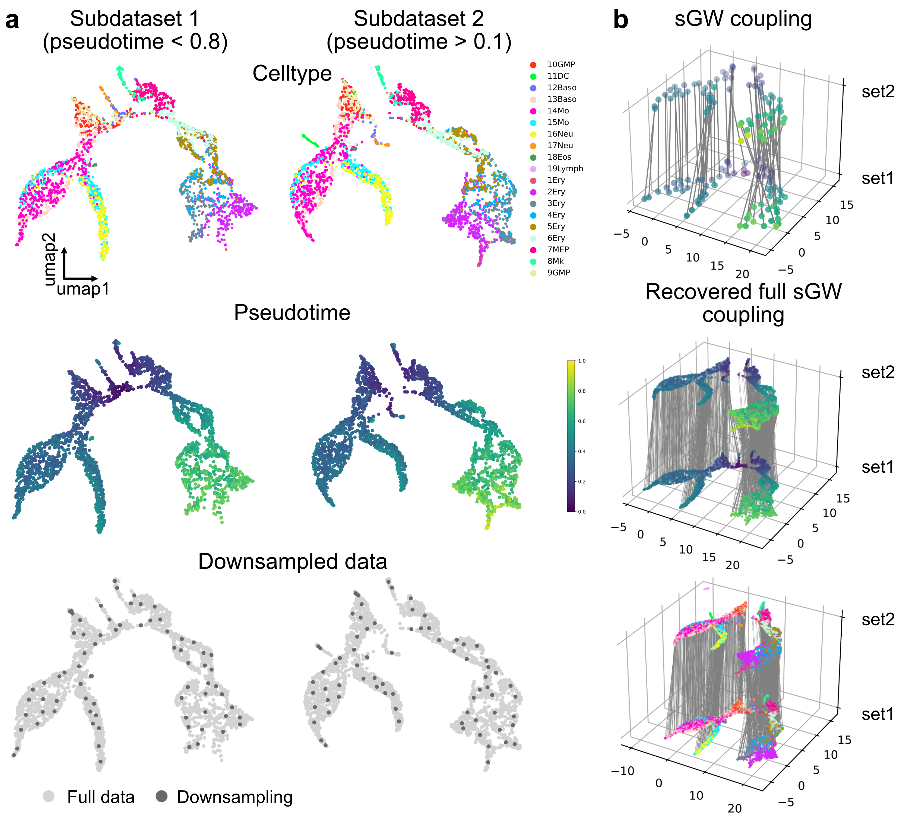

# Supervised Gromov-Wasserstein Optimal Transport

  

Supervised Gromov-Wasserstein (sGW) optimal transport, an extension of Gromov-Wasserstein that incorporates potential **infinity entries** in the cost tensor. These infinity entries enable sGW to enforce application-induced constraints on preserving **pairwise distances** to a certain extent.

# Examples

  
  

## Requirements

Python packages: 

POT

Networkx 

SciPy

Geosketch 

Kepler-Mapper 

UMAP

Scikit-learn

## Tutorial

We included a tutorial in this repository <tutorial.ipynb>. The tutorial will guide you through the required steps to run sGW with your own dataset.

## References

[1] Z Cang, Y Wu, Y Zhao. Supervised Gromov-Wasserstein Optimal Transport. `arxiv <https://arxiv.org/abs/2401.06266>`

If you found this library helpful, please consider citing it as:

    @article{cang2024supervised,
      title={Supervised Gromov-Wasserstein Optimal Transport},
      author={Cang, Zixuan and Wu, Yaqi and Zhao, Yanxiang},
      journal={arXiv preprint arXiv:2401.06266},
      year={2024}
    }
